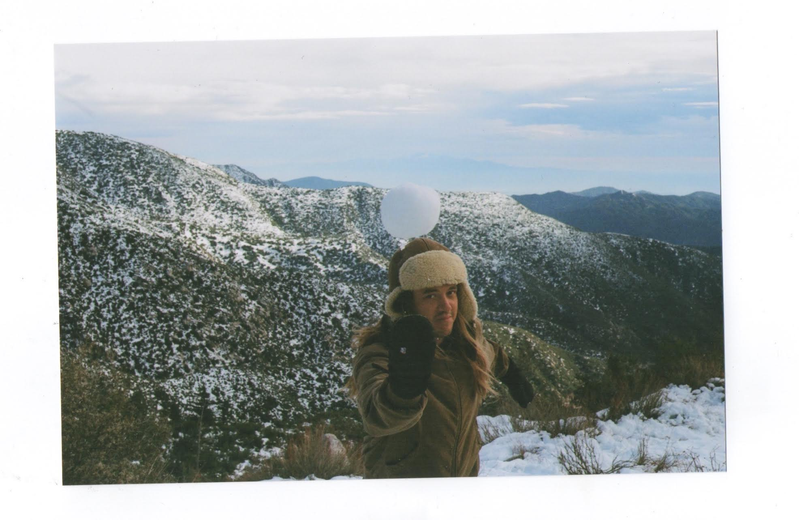

# Hi, I'm Drew Silva
</center_>

I'm a student in my last year at University of California Santa Barbara studying Anthropology and Geography with a minor in Applied Psychology. I plan to either become a wilderness therapist or a city planner with the purpose of building around nature or with nature. My passions include backpacking, surfing, hiking and playing music. 

